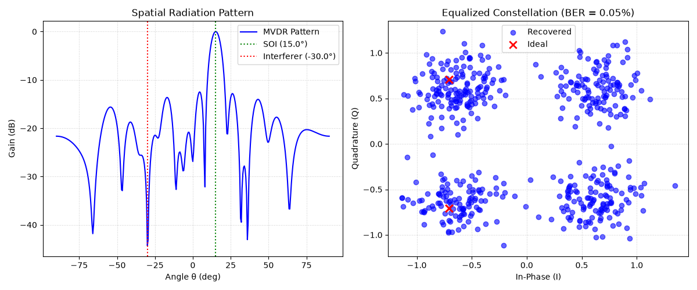

# 28 GHz mmWave Beamforming & Spatial Filtering Simulator

A Python-based simulation environment for millimeter-wave (mmWave) spatial array processing, minimum variance distortionless response (MVDR) beamforming, and signal recovery.



*Left: MVDR spatial pattern steering the main lobe to the signal of interest (15°) while placing a deep null on the interferer (−30°). Right: recovered QPSK constellation after spatial equalization (BER = 0.05%).*


## Features
* **Uniform Linear Array (ULA) Modeling:** Simulates spatial steering vectors and array responses at 28 GHz.
* **MVDR Adaptive Beamforming:** Dynamically suppresses interference by placing spatial nulls toward unwanted signals while steering main lobes toward targets.
* **QPSK Signal Recovery:** Evaluates Bit Error Rate (BER) performance before and after spatial equalization.
* **Modular Architecture:** Clean separation between physical array models, beamforming algorithms, and main execution scripts.

## Repository Structure
```text
beamforming-mmwave-sim/
├── src/
│   ├── __init__.py
│   ├── array_models.py      # ULA geometry and spatial response
│   └── beamformers.py       # MVDR and beamforming logic
├── .gitignore
├── README.md
└── main.py                  # Simulation launcher and plot generation

## How to Run

    pip install -r requirements.txt
    python main.py

Generates the spatial radiation pattern and equalized constellation plots.
